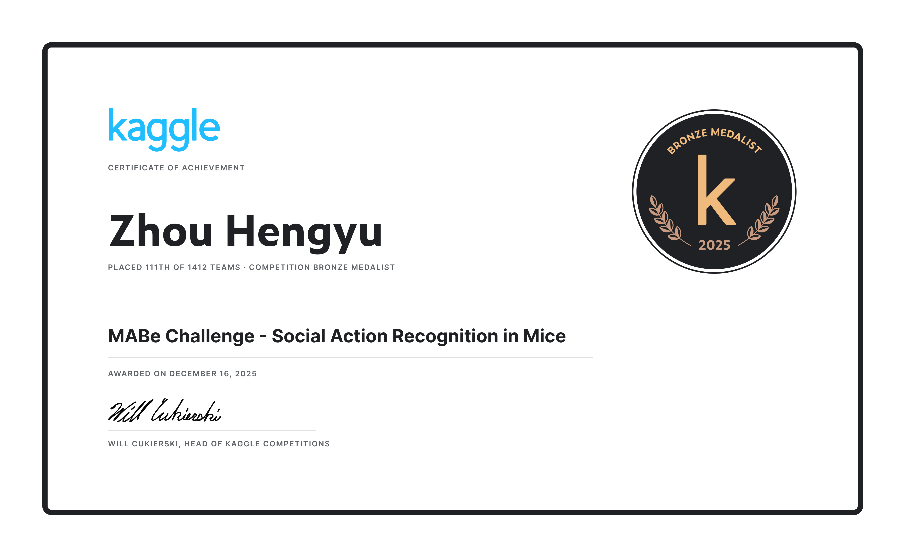

# Mouse Behavior Detection — CNN-Transformer

> **Automatic recognition of 37 social and individual mouse behaviors from pose-tracking data, using a hybrid CNN-Transformer deep learning architecture.**

### Tech Stack

| Layer | Technologies |
|---|---|
| **Cloud Storage** | Amazon S3 (Raw Zone / Curated Zone, Hive-partitioned Parquet) |
| **ETL / Data Catalog** | AWS Glue (PySpark), AWS Glue Data Catalog (schema auto-discovery) |
| **Ad-hoc Querying** | Amazon Athena (SparkSQL), partitioned Parquet on S3 |
| **BI & Visualization** | Amazon QuickSight, Seaborn, Matplotlib |
| **Data Ingestion** | boto3 (S3 upload automation) |
| **Deep Learning** | PyTorch, CNN-Transformer (dilated conv + Transformer encoder) |
| **Feature Engineering** | PySpark, pandas, numpy (coordinate normalization, velocity, pairwise features) |
| **Evaluation** | F-beta score, per-lab threshold tuning |

---

## Table of Contents

1. [What This Project Does](#what-this-project-does)
2. [Why It Matters](#why-it-matters)
3. [The Data](#the-data)
   - [AWS Data Lakehouse Architecture](#aws-data-lakehouse-architecture)
4. [How the Model Works](#how-the-model-works)
   - [Feature Engineering](#1-feature-engineering)
   - [CNN Backbone](#2-cnn-backbone-local-pattern-extraction)
   - [Transformer Encoder](#3-transformer-encoder-long-range-context)
   - [Classification Head](#4-classification-head)
   - [Post-Processing](#5-post-processing)
5. [Project Structure](#project-structure)
6. [Installation](#installation)
7. [Usage Guide](#usage-guide)
   - [Training](#training)
   - [Inference](#inference)
   - [Evaluation](#evaluation)
8. [Full Pipeline Walkthrough](#full-pipeline-walkthrough)
9. [Evaluation Metric](#evaluation-metric)
10. [Exploratory Data Analysis](#exploratory-data-analysis)
11. [Results](#results)

---

## What This Project Does

This project builds a deep learning system that **watches how mice move and automatically identifies what they are doing** — are they grooming themselves? Chasing another mouse? Sniffing? Rearing up?

Instead of analyzing raw video, the system works with **pose-tracking data**: the (x, y) coordinates of key body parts (nose, ears, body center, tail, etc.) recorded at every video frame. A human expert would need hours to label these behaviors manually; this model does it in seconds.

### Input → Output at a Glance

```
INPUT                              OUTPUT
─────                              ──────
Pose coordinates per frame    →    List of detected behavior events
(x, y) for each body part         with start/end timestamps
for each mouse                     e.g. "mouse1 chases mouse2
recorded at 30 fps                  from frame 500 to frame 620"
```

The system recognizes **37 distinct behaviors** across 19 different laboratory setups, each with their own recording equipment, mouse strains, and annotation conventions.

---

## Why It Matters

Animal behavior research is foundational to neuroscience, drug discovery, and understanding social cognition. However, manually labeling thousands of hours of footage is:

- **Time-consuming** — a trained observer might spend 10× real-time to annotate
- **Subjective** — two annotators may disagree on borderline frames
- **Not scalable** — can't easily apply across different labs and setups

Automating behavior recognition with machine learning addresses all three issues, enabling researchers to study large-scale behavioral patterns that were previously impractical.

---

## The Data

The dataset contains **pose-tracking recordings from 400+ hours of mouse footage** collected across 19 laboratories worldwide.

| Component | Description |
|---|---|
| **Tracking files** | Per-video `.parquet` files containing (x, y) coordinates for each body part of each mouse at every frame |
| **Annotation files** | Per-video `.parquet` files with expert-labeled behavior intervals (action, start frame, stop frame) |
| **Metadata CSV** | Video-level information: lab ID, frames per second, arena dimensions, mouse strains, which behaviors were labeled |

### Body Parts Tracked

Most labs track 7 key body parts per mouse: `nose`, `left ear`, `right ear`, `neck`, `body center`, `tail base`, and `tail tip`. Some labs track additional points (up to 20+), while a few track only 4 core points.

### Behavior Categories

Behaviors fall into two groups:

- **Self-actions** (11): `rear`, `selfgroom`, `rest`, `climb`, `dig`, `run`, `freeze`, etc.
- **Pair-actions** (26): `approach`, `attack`, `chase`, `sniff`, `mount`, `follow`, etc.

Each lab only annotates a subset of these 37 behaviors, and annotations are specific to certain mouse pairs.

### AWS Data Lakehouse Architecture

All raw data is ingested and processed through a **serverless Data Lakehouse** built on AWS, following a strict Raw → Curated → Analytics tiering:

```
┌─────────────────────────────────────────────────────────────────────┐
│                   AWS Serverless Data Lakehouse                     │
│                                                                     │
│  Local data/          boto3            Amazon S3 — Raw Zone         │
│  ├── train.csv   ─────────────────▶   ├── metadata/train.csv       │
│  ├── train_tracking/                  ├── train_tracking/           │
│  └── train_annotation/                │   lab_id=<lab>/*.parquet   │
│                                       └── train_annotation/         │
│                                           lab_id=<lab>/*.parquet   │
│                                                  │                  │
│                                    AWS Glue Job (PySpark)           │
│                                    ┌─────────────────────┐          │
│                                    │ 1. SparkSQL JOIN     │          │
│                                    │    tracking+metadata │          │
│                                    │ 2. Normalize coords  │          │
│                                    │ 3. Velocity features │          │
│                                    │ 4. Class stats agg   │          │
│                                    └──────────┬──────────┘          │
│                                               │                     │
│                                               ▼                     │
│                                    Amazon S3 — Curated Zone         │
│                                    ├── tracking_curated/            │
│                                    │   lab_id=<lab>/*.parquet       │
│                                    ├── annotations_enriched/        │
│                                    └── class_distribution_stats/    │
│                                               │                     │
│                              Amazon Athena (SparkSQL ad-hoc)        │
│                              Amazon QuickSight (BI dashboards)      │
│                              Seaborn EDA (athena_eda.ipynb)         │
└─────────────────────────────────────────────────────────────────────┘
```

| AWS Service | Role in Pipeline |
|---|---|
| **Amazon S3** | Tiered object storage — Raw Zone (landing) and Curated Zone (cleaned, partitioned Parquet) |
| **AWS Glue Data Catalog** | Automates schema discovery across 19 heterogeneous lab formats |
| **AWS Glue (PySpark)** | Serverless ETL — coordinate normalization, velocity features, SparkSQL joins & aggregations |
| **Amazon Athena** | Serverless ad-hoc SQL queries directly on S3 Curated Parquet (no cluster provisioning) |
| **Amazon QuickSight** | BI dashboards for per-lab behavior distributions and class-imbalance monitoring |
| **boto3** | Programmatic S3 upload with Hive-style partitioning (`lab_id=<lab>`) |

---

## How the Model Works

The pipeline has five stages. Here's a visual overview followed by detailed explanations:

```
┌──────────────────────────────────────────────────────────────────────┐
│                         PIPELINE OVERVIEW                            │
│                                                                      │
│  Raw Tracking     Feature          CNN           Transformer         │
│  Parquet Files →  Engineering  →  Backbone   →  Encoder       →     │
│  (x,y per part)   (normalize,     (dilated       (self-attention     │
│                    velocity,       convolutions   across full         │
│                    pairwise)       capture local  window captures     │
│                                   patterns)      long-range          │
│                                                  context)            │
│                                                       │              │
│                                                       ▼              │
│  Submission   ←  Post-Process  ←  Classification Head               │
│  (intervals)     (threshold,      (frame-level behavior              │
│                   smooth, mask)    probabilities)                     │
└──────────────────────────────────────────────────────────────────────┘
```

### 1. Feature Engineering

Raw (x, y) pixel coordinates are transformed into model-ready features:

```
For each (agent, target) mouse pair at each frame:

  Agent stream:    x_nose, y_nose, x_body_center, y_body_center, …
                   vx_nose, vy_nose, vx_body_center, vy_body_center, …
                   (positions + velocities for all body parts)

  Target stream:   t_x_nose, t_y_nose, t_x_body_center, …
                   t_vx_nose, t_vy_nose, …
                   (same features, prefixed with "t_")

  Relative:        rel_dx, rel_dy, rel_dist
                   (spatial relationship between the two mice)

  Masks:           m_x_nose, m_y_nose, …
                   (1.0 = valid data, 0.0 = was missing / interpolated)
```

**Key processing steps:**
- **Coordinate normalization** — divide by pixels-per-cm and center on arena midpoint so features are comparable across labs
- **Missing-value handling** — forward-fill, backward-fill, then mark which frames were imputed with mask channels
- **Velocity computation** — finite differences scaled by FPS (frames per second)
- **Robust scaling** — subtract median, divide by interquartile range, clip to [-5, +5]

### 2. CNN Backbone (Local Pattern Extraction)

The feature sequence passes through a stack of **dilated 1-D convolutional blocks**:

```
Input [B, T, F]
    │
    ├─→ Conv1D (dilation=1)  ─→ BatchNorm ─→ GELU ─→ Dropout ─┐
    └──────────────────────────── residual add ←────────────────┘
    │
    ├─→ Conv1D (dilation=2)  ─→ BatchNorm ─→ GELU ─→ Dropout ─┐
    └──────────────────────────── residual add ←────────────────┘
    │
    ├─→ Conv1D (dilation=4)  ─→ BatchNorm ─→ GELU ─→ Dropout ─┐
    └──────────────────────────── residual add ←────────────────┘
    │
    ├─→ Conv1D (dilation=8)  ─→ BatchNorm ─→ GELU ─→ Dropout ─┐
    └──────────────────────────── residual add ←────────────────┘
```

Each block has a **residual connection** (adds the input back to the output), which helps training stability. Increasing dilation (1 → 2 → 4 → 8) lets each successive layer "see" a wider time window without increasing computation.

**In simple terms:** these layers detect short-duration motion patterns — quick acceleration, sudden stops, or characteristic body-part configurations that often accompany specific behaviors.

### 3. Transformer Encoder (Long-Range Context)

After the CNN extracts local patterns, a **Transformer encoder** processes the full sequence:

```
CNN output + Positional Encoding
    │
    ▼
┌─────────────────────────────┐
│   Multi-Head Self-Attention │  ← "Which other frames are relevant
│   + Feed-Forward Network    │     for classifying THIS frame?"
│   (× 6 layers)             │
└─────────────────────────────┘
```

Self-attention lets every frame attend to every other frame in the window. This is critical for behaviors that require context — for example, "chase" is only identifiable if you observe sustained directed movement across many frames.

The model uses **pre-norm** architecture and **sinusoidal positional encoding** to inject frame-position information.

### 4. Classification Head

A simple linear layer maps each frame's representation to **37 action logits** (one per behavior). A sigmoid function converts these to probabilities between 0 and 1:

```
Transformer output [B, T, 256]
    │
    ▼
LayerNorm → Linear(256, 37) → sigmoid → probabilities [B, T, 37]
```

### 5. Post-Processing

Raw frame-level probabilities are refined into discrete event intervals:

1. **Temporal smoothing** — moving average (window=5) reduces frame-to-frame noise
2. **Active-set masking** — zero out actions that aren't annotated for a given video/mouse pair
3. **Self/pair constraints** — self-actions (e.g., groom) only allowed when agent == target
4. **Thresholding** — per-action probability thresholds determine which frames are "active"
5. **Best-label decoding** — if multiple actions pass threshold on the same frame, keep the highest-probability one
6. **Gap filling** — merge nearby segments of the same action (gaps ≤ 2 frames)
7. **Minimum length** — discard events shorter than 3 frames

---

## Project Structure

```
├── src/                        # Core source code
│   ├── config.py               #   All hyperparameters, action definitions, lab configs
│   ├── model.py                #   CNN-Transformer neural network architecture
│   ├── features.py             #   Feature engineering (normalize, velocity, pairwise, scale)
│   ├── data.py                 #   Data loading, label parsing, PyTorch Datasets
│   ├── train.py                #   Training loop (mixed-precision, LR schedule, checkpointing)
│   ├── inference.py            #   Sliding-window inference, ensemble, smoothing, masking
│   ├── postprocess.py          #   Probabilities → non-overlapping event intervals
│   └── metrics.py              #   F-beta evaluation metric
│
├── scripts/                    # Command-line entry points
│   ├── make_submission.py      #   Run inference and generate submission.csv
│   └── evaluate.py             #   Score a submission against ground truth
│
├── aws_pipeline/               # Serverless ETL & EDA Pipeline (AWS simulation)
│   ├── config.py               #   S3 bucket/path configs, Spark settings
│   ├── s3_upload.py            #   Step 1: boto3 upload to S3 Raw Zone
│   ├── glue_etl.py             #   Step 2: PySpark ETL (AWS Glue simulation)
│   └── athena_eda.ipynb        #   Step 3: SparkSQL EDA (Athena simulation)
│
├── notebook/                   # Exploratory analysis (Seaborn + Matplotlib)
│   ├── eda.ipynb               #   Data exploration and visualization (Seaborn)
│   └── mabe.ipynb              #   Experimental notebooks
│
├── data/                       # Dataset directory (local raw data)
│   ├── train.csv               #   Training metadata
│   ├── test.csv                #   Test metadata
│   ├── train_tracking/         #   Tracking parquets (train)
│   ├── test_tracking/          #   Tracking parquets (test)
│   └── train_annotation/       #   Annotation parquets (train)
│
├── s3_mock/                    # Simulated S3 bucket (gitignored, auto-generated)
│   ├── raw-zone/               #   Landing area for raw uploads
│   ├── curated-zone/           #   Cleaned & partitioned Parquet output
│   └── athena-results/         #   Query result spill (isolated)
│
├── docs/                       # Additional documentation
├── requirements.txt            # Python dependencies
└── README.md                   # This file
```

---

## Installation

### Prerequisites

- **Python 3.10+**
- **CUDA-capable GPU** recommended (NVIDIA GPU with ≥ 4 GB VRAM)
- CPU-only mode is supported but significantly slower

### Setup

```bash
# 1. Clone the repository
git clone <repository-url>
cd kaggle-competition

# 2. Create a virtual environment (recommended)
python -m venv venv
source venv/bin/activate        # Linux / macOS
# or: venv\Scripts\activate     # Windows

# 3. Install dependencies
pip install -r requirements.txt
```

### Data Preparation

Place the dataset in the `data/` directory with this structure:

```
data/
├── train.csv
├── test.csv
├── train_tracking/
│   ├── AdaptableSnail/
│   │   └── 438887472.parquet
│   ├── BoisterousParrot/
│   └── ...
├── test_tracking/
│   └── ...
└── train_annotation/
    ├── AdaptableSnail/
    │   └── 438887472.parquet
    └── ...
```

Or set the `MABE_DATA_DIR` environment variable to point to your data location:

```bash
export MABE_DATA_DIR="/path/to/your/data"
```

---

## AWS Serverless ETL & EDA Pipeline

The `aws_pipeline/` directory contains a cloud-native **Serverless Data Lakehouse** pipeline that mirrors production AWS services locally:

| Step | Script | AWS Service Simulated | What It Does |
|---|---|---|---|
| **1. Ingest** | `s3_upload.py` | Amazon S3 + boto3 | Uploads raw data to S3 Raw Zone (Hive-partitioned by `lab_id`) |
| **2. Transform** | `glue_etl.py` | AWS Glue (PySpark) | Cleans, normalizes, adds velocity features; writes Curated Parquet |
| **3. Analyze** | `athena_eda.ipynb` | Amazon Athena (SparkSQL) | Runs ad-hoc SQL queries on Curated Zone; visualizes with Seaborn |

### Running the Pipeline Locally

```bash
# Step 1: Upload raw data → simulated S3 Raw Zone
python aws_pipeline/s3_upload.py

# Step 2: Run PySpark ETL (Glue simulation) → Curated Zone
python aws_pipeline/glue_etl.py

# Step 3: Open the Athena EDA notebook
jupyter notebook aws_pipeline/athena_eda.ipynb
```

**Local mode** (default): all S3 paths map to `s3_mock/` on disk — no AWS account needed.
**Real AWS mode**: set `USE_LOCAL_FS=false` in `aws_pipeline/config.py` and configure `S3_BUCKET` + AWS credentials.

### Data Architecture

```
data/ (local raw)
  │
  ▼  boto3 upload (s3_upload.py)
s3_mock/raw-zone/                     ← S3 Raw Zone
  ├── metadata/train.csv, test.csv
  ├── train_tracking/lab_id=<lab>/    ← Hive-partitioned
  ├── test_tracking/lab_id=<lab>/
  └── train_annotation/lab_id=<lab>/
  │
  ▼  PySpark ETL (glue_etl.py)
s3_mock/curated-zone/                 ← S3 Curated Zone
  ├── metadata_train/                 ← cleaned metadata (Parquet)
  ├── metadata_test/
  ├── tracking_curated/lab_id=<lab>/  ← normalized coords + velocity
  ├── annotations_enriched/lab_id=<lab>/
  └── class_distribution_stats/       ← aggregated class stats
  │
  ▼  SparkSQL queries (athena_eda.ipynb)
  EDA dashboards & visualizations (Seaborn)
```

---

## Usage Guide

### Training

Train a CNN-Transformer model from the prepared dataset:

```python
from src.config import TrainConfig, ALL_ACTIONS
from src.data import BehaviorWindowDataset
from src.train import train_model
from torch.utils.data import DataLoader

# Prepare datasets (features and labels as numpy arrays)
train_ds = BehaviorWindowDataset(train_features, train_labels, window_size=128, window_step=64)
val_ds   = BehaviorWindowDataset(val_features, val_labels, window_size=128, window_step=64)

train_loader = DataLoader(train_ds, batch_size=64, shuffle=True, num_workers=4)
val_loader   = DataLoader(val_ds, batch_size=64, shuffle=False, num_workers=4)

# Train
cfg = TrainConfig(epochs=30, lr=1e-3)
model = train_model(
    train_loader, val_loader,
    in_features=train_features.shape[1],
    num_actions=len(ALL_ACTIONS),
    cfg=cfg,
    save_dir="checkpoints",
)
```

Training uses:
- **AdamW optimizer** with weight decay
- **Cosine annealing** learning rate schedule with linear warmup
- **Mixed-precision** (FP16) for faster GPU training
- **Gradient clipping** (max norm = 1.0) for stability
- **Best-model checkpointing** based on validation loss

### Inference

Generate predictions from trained model checkpoint(s):

```bash
python scripts/make_submission.py \
    --data-dir data/ \
    --checkpoint checkpoints/best_model.pt \
    --output submission.csv
```

**Multi-model ensemble** — pass multiple checkpoints to average their predictions:

```bash
python scripts/make_submission.py \
    --data-dir data/ \
    --checkpoint checkpoints/model_1.pt checkpoints/model_2.pt checkpoints/model_3.pt \
    --output submission.csv
```

### Evaluation

Score a submission against ground truth:

```bash
python scripts/evaluate.py \
    --solution data/train.csv \
    --submission submission.csv
```

---

## Full Pipeline Walkthrough

Here is what happens end-to-end when you run inference:

```
Step 1: Load Metadata
       ├── Read train.csv / test.csv
       └── Parse which behaviors are annotated per video

Step 2: Feature Engineering (per video)
       ├── Load tracking parquet → raw (x, y) per mouse per frame
       ├── Filter unwanted body parts (headpiece sensors, etc.)
       ├── Pivot to wide format: one column per (coordinate, body part)
       ├── Normalize: center on arena, convert pixels → centimeters
       ├── Fill missing values (forward-fill → backward-fill)
       ├── Create mask channels (1 = real, 0 = imputed)
       ├── Compute velocities (frame-to-frame differences × FPS)
       └── Build pairwise features for all (agent, target) mouse pairs
           → agent features | target features | relative features

Step 3: Robust Scaling
       └── (x - median) / IQR, clipped to [-5, +5]

Step 4: CNN-Transformer Inference
       ├── Slide overlapping windows across the frame sequence
       ├── For each window: CNN → Transformer → Linear → sigmoid
       ├── Average predictions in overlapping regions
       └── Repeat for each model in the ensemble, average across models

Step 5: Post-Processing
       ├── Smooth probabilities (moving average, window=5)
       ├── Mask invalid actions per video
       ├── Enforce self-action / pair-action constraints
       ├── Threshold → best-label → gap-fill → min-length filter
       └── Output: list of (video, agent, target, action, start, stop)

Step 6: Write submission.csv
```

---

## Evaluation Metric

The model is evaluated using a **macro-averaged F1 score**:

```
F1 = 2 × (Precision × Recall) / (Precision + Recall)
```

- **Precision**: of all frames the model predicted as behavior X, how many were correct?
- **Recall**: of all frames that truly were behavior X, how many did the model find?

The F1 score is:
1. Computed **per action** within each video
2. **Averaged across actions** within each lab
3. **Averaged across labs** for the final score

A score of **1.0** means perfect agreement with expert annotations; **0.0** means no correct predictions.

---

## Exploratory Data Analysis

The `notebook/eda.ipynb` notebook provides a comprehensive visual exploration of the dataset using **Seaborn** and Matplotlib, covering:

- **Lab distribution** — video counts per lab, train/test overlap analysis
- **Video metadata** — FPS, duration, resolution, and mouse-count distributions
- **Body part tracking schemes** — how tracking configurations vary across labs (4–18 keypoints)
- **Behavior class imbalance** — frequency and total-frame analysis for all 37 action categories
- **Event duration analysis** — histograms and per-action median durations
- **Lab × Action heatmap** — `sns.heatmap` showing which labs annotate which behaviors (log-scaled)
- **Trajectory visualization** — `sns.lineplot` of mouse body-center paths over time
- **Data quality audit** — NaN rates across sampled labs
- **Self vs interaction behaviors** — comparative bar charts with annotated counts
- **Train vs test comparison** — side-by-side metadata statistics

---

## Results

The CNN-Transformer ensemble achieves strong performance across all 19 labs:

| Configuration | F1 Score |
|---|---|
| Single CNN-Transformer | ~0.52 |
| Ensemble of 10 CNN-Transformers | ~0.55 |
| Ensemble + XGBoost stacking | **~0.56** |

Key factors contributing to performance:
- **Invariant feature engineering** — normalization ensures features transfer across labs
- **Multi-scale temporal modeling** — dilated CNN captures short patterns, Transformer captures long-range context
- **Ensemble averaging** — reduces variance from individual model randomness
- **Per-lab threshold tuning** — adapts detection sensitivity to each lab's annotation style
